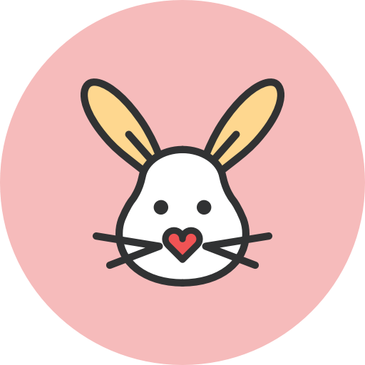

# Bunny-Notifier

Simple notification wrapper class for grouping notification and support remoteviews for android. 
1. It can support android project over API 16 (JellyBean)
2. It can support notification grouping with using summary notification over API 24 (Nougat)
3. It can support creating notification channel over API 26 (Oreo)

## Settings
### 1. gradle
##### add this code into project build.gradle file
~~~groovy
allprojects {
    repositories {
   		...
   		jcenter()
   	}
}
~~~

##### add this into module(app) build.gradle file
~~~groovy
dependencies {
	...
	implementation 'com.skfo763.bunny_notifier:bunny-notifier:1.0.0'
}
~~~

### 2. maven
~~~groovy
<repositories>
	<repository>
	    <id>Bunny-Notifier</id>
        <url>"http://dl.bintray.com/skfo763/Bunny-Notifier/"</url>
	</repository>
</repositories>
~~~
##### and add dependency
~~~groovy
<dependency>	   
	<groupId>com.skfo763.bunny_notifier</groupId>
    <artifactId>bunny-notifier</artifactId>
	<version>1.0.0</version>
</dependency>
~~~

## How to use
### 1. Make Notification Channel
- Make your own notification channel for project over API 26
~~~kotlin
@SuppressLint("MissingPermission")  
private fun makeChannel(groupId: String): NotifierChannel {  
	  return NotifierChannel(groupId, groupId)  
		 .setLockScreenVisibility(NotifierVisibility.VISIBILITY_PUBLIC)  
		 .setImportance(NotifierImportance.IMPORTANCE_HIGH)  
		 .setEnableVibration(true)  
		 .setVibrationPattern(longArrayOf(0, 500L))  
		 .setEnableSound(true)  
		 .setEnableShowLights(true)  
		 .setLightColor(Color.parseColor("#64b5f6"))  
		 .setShowBadge(true)  
}
~~~

- if you want to set your custom group notification channel, please add code like this
~~~kotlin
@SuppressLint("MissingPermission")  
private fun makeGroupChannel(): NotifierChannel {  
	  return NotifierChannel(groupChannel, groupChannel)  
		 .setLockScreenVisibility(NotifierVisibility.VISIBILITY_PUBLIC)  
		 .setImportance(NotifierImportance.IMPORTANCE_DEFAULT)  
		 .setEnableVibration(false)  
		 .setEnableSound(false)  
		 .setEnableShowLights(false)  
		 .setLightColor(Color.parseColor("#64b5f6"))  
		 .setShowBadge(true)  
}
~~~

### 2. Send Notification
- System style notification
~~~kotlin
private fun sendNotification(notificationId: Int, groupId: String) {  
	  val channel = makeChannel(groupId)  
	  val groupChannel = makeGroupChannel()  
	  
	  BunnyNotifier.i.with(applicationContext, channel)  
		 .setBase(BaseNotification("hello", "hello system", R.mipmap.ic_launcher_round))  
		 .setClickAction(getPendingIntent())   
		 .setAutoCancel(true)  
		 .show(notificationId)  
}
~~~

- Custom style notification
~~~kotlin
private fun sendNotification(notificationId: Int, groupId: String) {  
	  val channel = makeChannel(groupId)  
	  val groupChannel = makeGroupChannel()  
	  
	  BunnyNotifier.i.with(applicationContext, channel)  
		 .setCustom(CustomNotification("hello", "hello custom", R.mipmap.ic_launcher_round, remoteView))  
		 .setClickAction(getPendingIntent())   
		 .setAutoCancel(true)  
		 .show(notificationId)  
~~~

- If you want to group multiple push to one summary push, you can call setGroup() method.
- Arguments for setGroup()

| name | type |description | default value |
|:---------|:-------|:-------------------------|:-------|
| groupSmallIconResId | Int | Resourece Id for small icon in noti-bar | ic_bunny_icon |
| groupId | String | maximum line for recyclerview | "Notifier-Group" |
| groupChannel | NotifierChannel |default state of recyclerview (true = expanded, false = collapsed) | DefaultChannel |

- Example
~~~kotlin
private fun sendGroupNotification(id1: Int, id2: Int, groupId: String) {  
  val channel = makeChannel(groupId)  
  val groupChannel = makeGroupChannel()  
  
  BunnyNotifier.i.with(applicationContext, channel)  
	 .setCustom(NotifierCustom("hello", "hello custom", R.mipmap.ic_launcher_round, makeRemoteView()))  
	 .setClickAction(getPendingIntent())  
	 .setGroup(3, R.mipmap.ic_launcher_round, groupId, groupChannel)  
	 .setAutoCancel(true)  
	 .show(id2)  

  BunnyNotifier.i.with(applicationContext, channel)  
	 .setBasic(NotifierCustom("hello2", "hello system 2", R.mipmap.ic_launcher_round)  
	 .setClickAction(getPendingIntent())  
	 .setGroup(3, R.mipmap.ic_launcher_round, groupId, groupChannel)  
	 .setAutoCancel(true)  
	 .show(id1)  
}
~~~
This function would be call one summary notification which contains two seperate notification (1 system, 1 custom)

### 3. Other functions
Other Informations & functions are wroted at **NotificationSettingsImpl.kt** 
- Example
~~~kotlin
/**  
 * Group Click Event - with PendingIntent
 * @param clickIntent : PendingIntent of click action  
 * @return The same Builder.  
 */@TargetApi(24)  
fun setGroupClickIntent(clickIntent: PendingIntent): NotificationSettingsImpl
~~~
 
# Contribution
### All kind of contribution is welcomed. Please send me a pull request

# license
~~~
Copyright 2020 Changyeon-Seo

Licensed under the Apache License, Version 2.0 (the "License");
you may not use this file except in compliance with the License.
You may obtain a copy of the License at

    http://www.apache.org/licenses/LICENSE-2.0

Unless required by applicable law or agreed to in writing, software
distributed under the License is distributed on an "AS IS" BASIS,
WITHOUT WARRANTIES OR CONDITIONS OF ANY KIND, either express or implied.
See the License for the specific language governing permissions and
limitations under the License.
~~~
